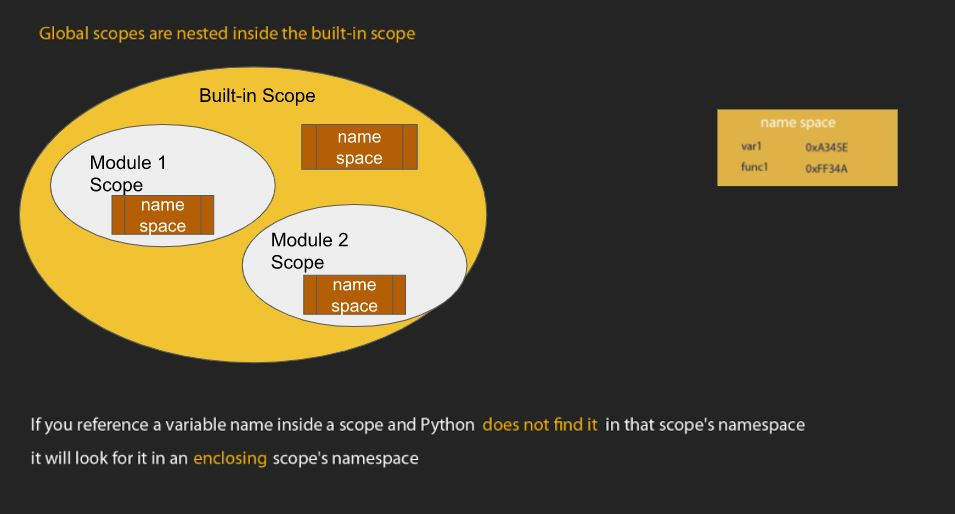
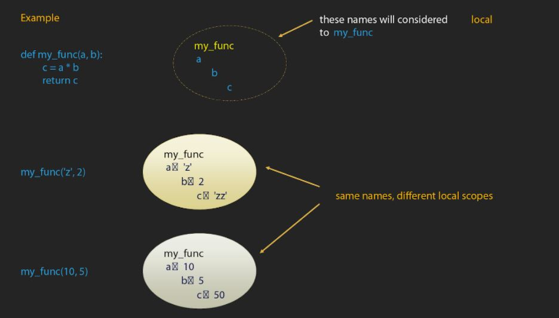
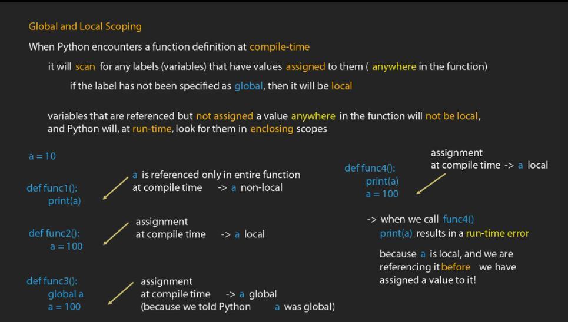

<h1> Scoping rules </h1>

A new local namespace is created each time a function is executed. It is the local environment that has the assigned values used in function like parameters, variables. When resolving names, python interpreter first searches the local namespace, global namespace and builtin namespace in that order. If no match is found, it gives a NameError exception. 

* Global scope is essentially module scope. It spans a single file only. The built-in and global variables can be used anywhere inside the module including inside any function.
* Local scope: when functions are created, variable names can be created inside the functions using assignments. 
* Variables inside the function are not created until functions are called
* Everytime a function is called, a new scope is created

* Global keyword:  global keyword tells python that a variable is meant to be in the 'global-scope'
* Python will scan for any variables that have values assigned to them (anywhere in function - order doesnt matter)

<h1> Nested Functions </h1>

* Functions can be defined from inside another function
* Both functions have access to global and built-in scopes as well as their respective local scopes
* Inner functions will also have access to its enclosing scopes (scope of outer function)
* That scope is neither local (to inner function) nor global. It is called nonlocal scope

