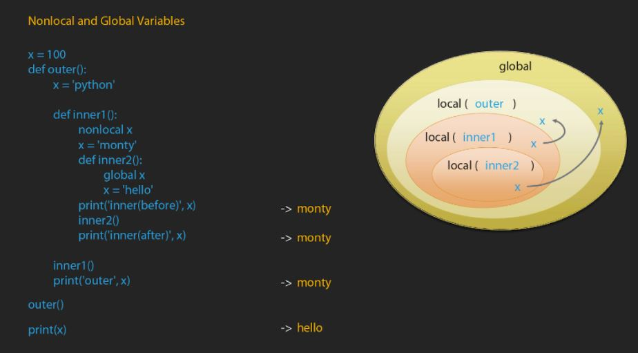
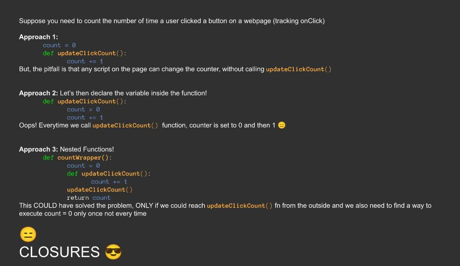
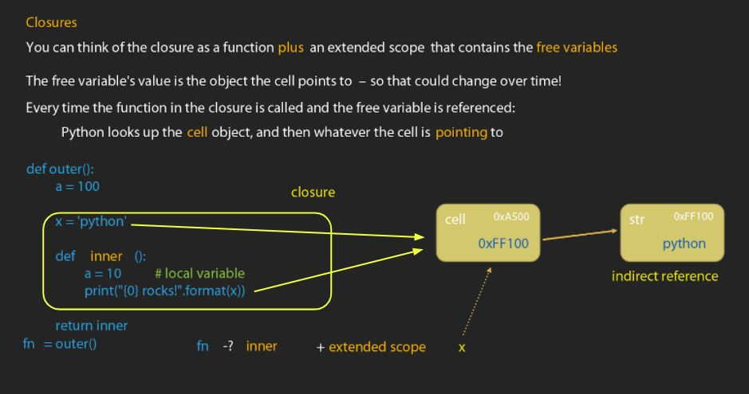
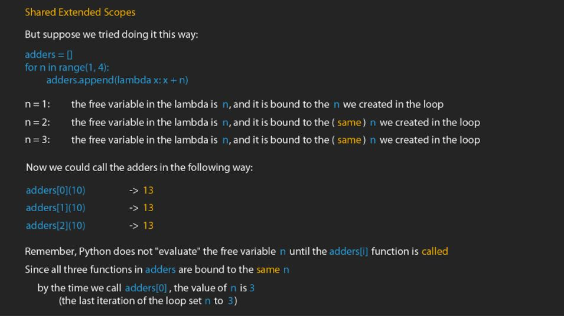
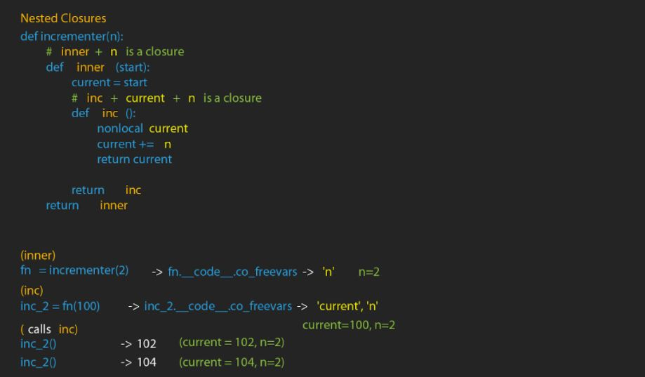

<h1> Scoping rules </h1>

A new local namespace is created each time a function is executed. It is the local environment that has the assigned values used in function like parameters, variables. When resolving names, python interpreter first searches the local namespace, global namespace and builtin namespace in that order. If no match is found, it gives a NameError exception. 


* Global scope is essentially module scope. It spans a single file only. The built-in and global variables can be used anywhere inside the module including inside any function.
* Local scope: when functions are created, variable names can be created inside the functions using assignments. 
* Variables inside the function are not created until functions are called
* Everytime a function is called, a new scope is created


* Global keyword:  global keyword tells python that a variable is meant to be in the 'global-scope'
* Python will scan for any variables that have values assigned to them (anywhere in function - order doesnt matter)


<h1> Nested Functions </h1>

* Functions can be defined from inside another function
* Both functions have access to global and built-in scopes as well as their respective local scopes
* Inner functions will also have access to its enclosing scopes (scope of outer function)
* That scope is neither local (to inner function) nor global. It is called nonlocal scope

```
a = 10
def outer_func():
  global a
  a = 1000
  
  outer_func()
  print(a)
  
```  
The output is 1000. The same can be achieved using inner functions using the code below:
```
def outer_func2():
  def inner_func():
    global a
    a = "Hello"
  inner_func()
outer_func2()
print(a)
```
The code above demonstrates the use of the global keyword to access outer function variable from inner function

* To modify non local variables, nonlocal keyword should be used

```
def outer_func():
  x = 'hello'
  
  def inner_func():
    nonlocal x
    x = 'python'
  inner_func()
  print(x)
outer_func()

```
By explicitly calling x as nonlocal, the value of x is assigned to 'python'. calling outer_func would generate an output 'python'

* Whenever python is told that a variable is nonlocal, it looks for enclosing local scopes but not in **global** scope



<h1> Closures and Applications </h1>

<h2> Advantages of Closure </h2>



<h2> What are Closures? </h2>



```
def outer():
    x = 'python'
    print(hex(id(x)))
    def inner():
        print(hex(id(x)))
        print("{0} rocks!".format(x))
    return inner
fn = outer()
fn()
```
In the code above, the hex(id()) of x at both the locations  - outer and innter will be the same.

* Every time a function is run, a new scope is created. If that function generates a closure, a new closure is created every time as well

```
def counter():
  count = 0
  
  def inc():
    nonlocal count
    count+=1
    return count
  return inc
f1 = counter()
f2 = counter()
f1()
f1()
f1()
f2()
```
Output: 1 2 3 1

* In the above code, f1 and f2 do not have the same extended scope. They are different instances of closure. 
* Two or more inner functions may have a shared extended scopes





<h1> Assignment </h1>

* Write a closure that takes a function and then check whether the function passed has a docstring with more than 50 characters. 50 is stored as a free variable
* Write a closure that gives you the next Fibonacci number
* We wrote a closure that counts how many times a function was called. Write a new one that can keep a track of how many times add/mul/div functions were called, and update a global dictionary variable with the counts
* Modify above such that now we can pass in different dictionary variables to update different dictionaries
